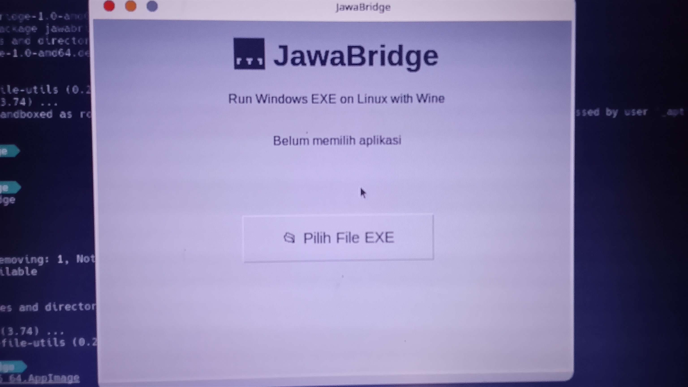

# 🌉 JawaBridge

Run Windows applications on Linux easily using Wine.

## ✨ Features

✅ Simple GUI  
✅ EXE architecture detection  
✅ Desktop shortcut generator  
✅ Wine integration  
✅ AppImage support  
✅ Debian package support

## 📸 Screenshot

## 🚀 Installation

### AppImage

Download:
JawaBridge-x86_64.AppImage

Run:

chmod +x JawaBridge-x86_64.AppImage
./JawaBridge-x86_64.AppImage

### Debian

sudo apt install ./JawaBridge.deb

## Requirements

- Linux
- Wine

## 🛠 Troubleshooting

Mengalami masalah saat menggunakan JawaBridge?

Baca panduan troubleshooting:

[📖 Troubleshooting Guide](docs/TROUBLESHOOTING.md)

## Roadmap

- [x] EXE launcher
- [x] Architecture detector
- [ ] Auto Wine installer
- [ ] Better UI
- [ ] EXE icon extraction
- [ ] Application library

## 📥 Download

Download versi terbaru JawaBridge melalui GitHub Release:

[⬇️ Download JawaBridge Latest Release](../../releases/latest)

Tersedia:

- 🐧 AppImage (All Linux Distribution)
- 📦 DEB Package (Debian / Ubuntu / Linux Mint)

---

## Installation

# Developer 

JawaBridge Teams 
Name: Siswanto 

## License

MIT License
